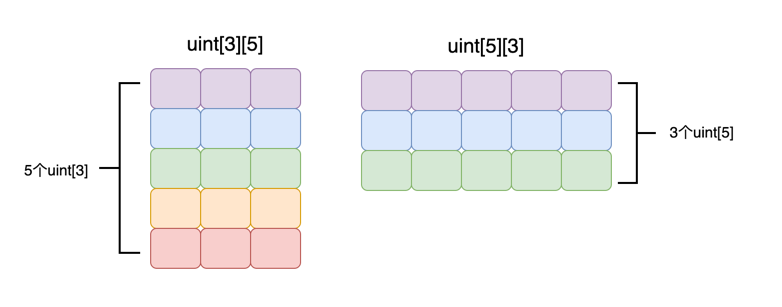

# Solidity 多维数组

前面的章节我们学习了[数组](array)，知道了数组是同类型元素的集合。我们目前看到过的都是一维数组。想象一下，假设你的合约不仅仅是管理一种NFT了， 而是管理多种NFT。比如说你同时持有多个Crypto Punk和多个Bored Ape。


如果你把他们的NFT ID全部放在同一个一维数组里面显然不太合适，因为Crypto Punk和Bored Ape都有ID为1001，1002，1003... 的NFT。这个时候你就希望把它们分组。用一个数组专门记录Crypto Punk的NFT ID，另外一个数组用来专门记录Bored Ape的NFT ID。如下面的例子所示：

```solidity
// 分别记录两种NFT ID
uint[3] memory cryptoPunk = [uint(1001), 1002, 1003];
uint[5] memory boredApe = [uint(1001), 1002, 1003, 2001, 2002];

```

这种方法似乎解决了我们的问题，但是万一我某一天要买一种新的NFT怎么办？我的合约已经部署了，不能再更改了。所以这种方法也有不足之处，不能灵活新增NFT种类。这个时候我们就需要用到多维数组来完美解决这个问题。

## 多维数组的声明

多维数组也是同类型元素的集合。只不过它在这个基础上再分组而已。例如，我们可以创建一个二维数组，如下所示：

```solidity
uint[3][3] memory arr;
```

我们也可以创建一个三维数组，如下所示：

```solidity
uint[3][3][3] memory arr;
```

多维数组也有静态和动态之分：

- **静态多维数组** (_static multi-dimensional array_)
- **动态多维数组** (_dynamic multi-dimensional array_))

### 静态多维数组的声明

假设 `T` 是一种类型，那么静态多维数组的声明格式如下：

```solidity
T[col][row] DataLocation arrName;
```

其中 `DataLocation` 是数据位置， `arrName` 是你为这个数组起的任意名字。而 `row` 和 `col` 则定义了你的多维数组有多少行和列。例如 `uint[3][5]` 就声明了一个5行3列的多维数组。如果你有学过其他语言，你会发现这样的声明方式跟其他语言是**恰恰相反**的。比如C语言和Javascript等在声明一个5行3列的多维数组，格式应该是 `uint[5][3]` 才对。这点要务必注意，尤其是在遍历多维数组的时候一不小心就搞反了。



所以我们现在知道了Solidity的多维数组声明要**从右往左**看, 例如 `uint[2][3][4]` 包含了4个 `uint[2][3]` 静态数组。进一步拆解, 其中每个 `uint[2][3]` 代表的是: 包含了3个 `uint[2]` 的静态数组, 以此类推。

:::caution 注意
Solidity在声明多维数组的时候「行」和「列」跟C语言, Javascript等是相反的
:::

:::tip 声明静态多维数组

```solidity
uint[3][5] memory arrMem;
uint[3][5] storage arrStorage;
```

:::

要注意在 Solidity 中静态多维数组的大小必须在编译时确定。这意味着你不能使用变量来指定多维数组的大小。例如，下面的代码是不合法的：

:::tip 静态多维数组的大小必须要能够在编译期间确定

```solidity
uint size = 2;
uint[size][size] memory arr; // 非法，size 是变量，其值无法再编译期确定
```

:::

### 动态多维数组的声明

假设 `T` 是一种类型，那么动态多维数组的声明格式如下：

```solidity
T[][] DataLocation arrName;
```

其中 `DataLocation` 是数据位置，而 `arrName` 是你为这个数组起的任意名字。虽然动态多维数组没有指定行和列，但是它的行为跟静态多维数组是一样的。也就是说它的行和列跟其他语言相比也是反的。我们同样需要**从右往左**去阅读动态多维数组的声明。

:::tip 声明动态多维数组

```solidity
uint[][] memory arrMem; // 行列数任意的动态多维数组
uint[][3] memory arrMem2; // 行为3，列任意的动态多维数组
uint[][] storage arrStorage; // 行列数任意的动态多维数组
```

:::

## 多维数组的初始化

### 静态多维数组的初始化

静态多维数组的初始化和静态一维数组的初始化差不多

#### 零值初始化

如果你只声明静态多维数组，不手动初始化，那么它的所有元素都会被零值初始化（_zero value initialized_)。也就是说，所有元素都会被赋予默认值。

:::tip 零值初始化静态多维数组

```solidity
uint[2][3] memory arr; //所有元素都是0
```

:::

#### 多维数组字面值初始化

你可以使用「多维数组字面值」对静态多维数组进行初始化。「多维数组字面值」的格式是 `[[..],[..]]` ，例如我们可以有 `[[1,2,3],[4,5,6]` ，也可以有 `[['str1', 'str2', 'str3'],['str4']]` 等等。下面的例子中我们用多维数组字面值初始化了一个静态多维数组：

:::tip 多维数组字面值初始化静态多维数组

```solidity
//必须使用uint(1)和uint(4)显式地将「数组字面值」第一个元素的类型转换成uint
uint[3][2] memory arr = [[uint(1), 2, 3], [uint(4), 5, 6]]; 
```

:::

与一维数组类似，「多维数组字面值」的「基础类型」(_base type_)，是其第一个元素的类型。所以我们要强制使用 `uint(1)` 和 `uint(4)` 来对第一个元素进行类型转换

如果我们不强制将第一个元素转换成与我们所定义的数组的基础类型（在上面的例子中是 `uint` ）相同，那么编译器会报错。如下面的示例所示：

:::tip 「多维数组字面值」的「基础类型」需要和「多维数组」的「基础类型」相同
本示例编译期间会报错，类型不匹配。因为第一个元素 `1` 会被隐式转换成能装得下它的最小整型，也就是 `uint16` 。与我们定义的数组的基础类型 `uint` 不匹配。

```solidity
// 编译报错，类型不匹配
uint[3][2] memory arr = [[1, 2, 3], [uint(4), 5, 6]]; 
```

:::

另外要注意的一点是定义的「多维数组」的维度必须跟「多维数组字面值」的维度是一样的，否则也会编译报错。如下面例子所示：

:::tip 定义的「多维数组」的维度必须跟「多维数组字面值」的维度一致
多维数组定义的维度是2*3，但是字面值中的 `[uint(4)]` 缺少两个元素

```solidity
uint[3][2] memory arr = [[uint(1), 2, 3], [uint(4)]]; //编译错误 
```

:::

### 动态多维数组初始化

动态多维数组初始化需要使用到 `new` 关键字。其所有元素值被「零值初始化」。也就是所有元素都会被赋值为默认值。如下所示，初始化了一个整型动态多维数组：

:::tip 动态多维数组初始化
初始化了一个2*3的动态多维数组，元素值被初始化为零值

```solidity
uint[][]  storageArr;
function initArray() public {
    uint n = 2;
    uint m = 3;
    for(uint i = 0; i < n; i++){
        storageArr.push(new uint[](m));
    }
}
```

:::

不要忘记静态数组的长度是不可以改变的，所以不会有 `push` , `pop` 函数。假设你定义了一个数组 `uint[][3] storageArr` ，它里面包含了3个 `uint[]` 动态数组。其中3是固定的，所以你不能执行 `storageArr.push(new uint[](k))` 。像下面这样是非法的：

:::tip 静态数组长度不可改变，不可 `push` , `pop`

```solidity
uint[][3] storageArr;
function invalidPush() public {
    uint k = 2;
    storageArr.push(new uint[](k)); // 编译错误
}
```

:::

但是因为 `storageArr[0]` 是一个 `uint[]` 动态数组，所以你是可以对其使用 `push` 的，如下所示：

:::tip 动态数组可以 `push` , `pop`

```solidity
uint[][3] storageArr;
function validPush() public {
    storageArr[0].push(999); // 合法
}
```

:::

如果动态多维数组是定义在 `storage` ，那么也可以用字面值来初始化：

:::tip 在 `storage` 的动态多维数组可以用字面值初始化

```solidity
uint[][] storageArr = [[uint(1), 2], [uint(3), 4]]; // 动态数组只有在storage位置才能用数组字面值初始化
```

:::

## 下标访问

多维数组的下标访问和一维数组的下标访问相似。下标访问所使用的操作符也是 `[]` ，下标索引从 `0` 开始。

:::tip 多维数组的下标访问

```solidity
uint[3][2] memory arr = [[uint(1), 2, 3], [uint(4), 5, 6]];
arr[0][0] = 1;
arr[2][1] = 2;
```

:::

## 参考资料

https://jeancvllr.medium.com/solidity-tutorial-all-about-array-efdff4613694
