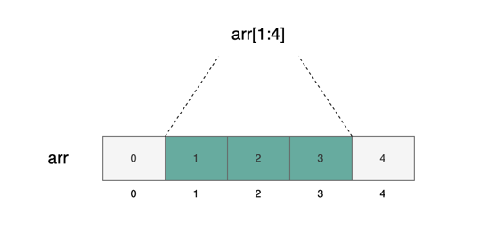
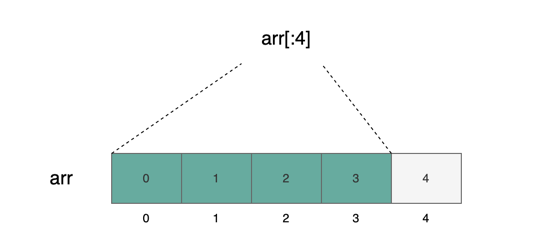
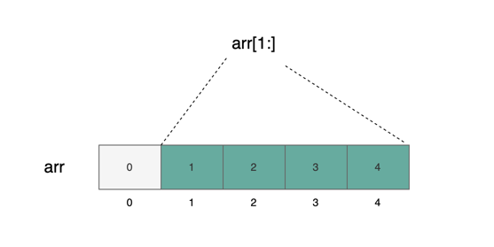
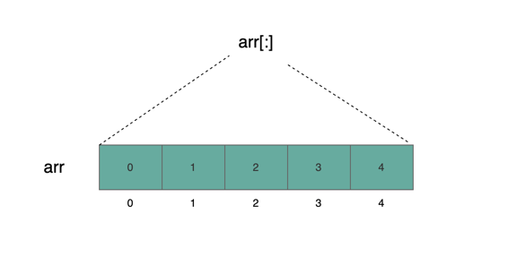

# 数组切片

数组切片（_array slice_）是基于数组建立的视图（_view_）。其语法为 `arr[start:end]` 。视图包含的是从 `start` 到 `end-1` 的元素。与数组不同的是，视图是没有类型的，也不能占据存储空间。它是为了方便我们对数据进行处理的一种抽象方式。

## 多种数组切片表示方式

如下图所示，底层数组 `arr` 一共有5个元素 `[0, 1, 2, 3, 4]` 。那么 `arr[1:4]` 的视图被涂成墨绿色，一共是3个元素。根据前面的定义，我们知道 `start=1` ， `end=4` 。所以其包含的是从下标1到下标(4-1)=3的元素。



其中 `start` 和 `end` 都是可以被省略的。如果省略了 `start` ，那么会包含从 `0` 到 `end-1` 的元素：



如果省略了 `end` 那么会包含 `start` 到 `arr.length - 1` 的元素：



如果 `start` 和 `end` 都省略了，那么会包含 `arr` 所有元素：



## 数组切片示例

下面展示了一个数组切片截取字符串前4bytes的示例：

:::tip 数组切片截取字符串前4bytes

```solidity
// 如果输入"abcdef"，将会输出"abcd"
function extracFourBytes(string calldata payload) public view {
    string memory leading4Bytes = string(payload[:4]);
    console.log("leading 4 bytes: %s", leading4Bytes);
}
```

:::

##  数组切片只能作用于 calldata 

:::caution
目前只能对 `calldata` 使用数组切片。 `memory` 和 `storage` 都不可以使用
:::

目前只能对 `calldata` 使用数组切片，否则编译会报错。因为 `calldata` 数据是不可更改的，所以你也不能更改数组切片的值。

:::tip 编译错误：数组切片不能用在 `memory` 或者 `storage`

```solidity
uint[5] memory arr1 = [uint(0), 1, 2, 3, 4];
uint[3] memory arrSlice1 = arr[1:4]; // 编译错误

uint[5] storage arr2 = [uint(0), 1, 2, 3, 4];
uint[3] storage arrSlice2 = arr[1:4]; // 编译错误
```

:::
