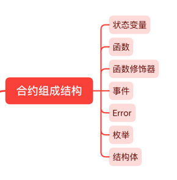

# 合约组成结构

你可能会有个疑问就是合约它都由什么基本结构组成的呢?我们在编写合约的时候又是如何把这些基本结构结合在一起的呢?这一节我们来探讨一下合约的七大组成结构,并且了解它们互相间的关系。

合约的七大组成结构有:

* **状态变量**
* **函数**
* **函数修饰器**
* **事件**
* **Error**
* **结构体**
* **枚举**



## 一个典型的合约

为了方便介绍每个组成结构都是什么,长什么样的,我们先看一个例子.下面是一个Owner合约,它别的事情都不干,只是记录谁是这个合约Owner.

:::tip Owner合约
```solidity
// SPDX-License-Identifier: GPL-3.0

pragma solidity ^0.8.9;

contract Owner {

    // 结构体
    struct Identity {
        address addr;
        string name;
    }

    // 枚举
    enum State {
        HasOwner,
        NoOwner
    }

    // 事件
    event OwnerSet(address indexed oldOwnerAddr, address indexed newOwnerAddr);
    event OwnerRemoved(address indexed oldOwnerAddr);

    // 函数修饰器
    modifier isOwner() {
        require(msg.sender == owner.addr, "Caller is not owner");
        _;
    }

    // 状态变量
    Identity private owner;
    State private state;

    // 下面的都是函数
    
    // 构造函数
    constructor(string memory name) {
        owner.addr = msg.sender;
        owner.name = name;
        state = State.HasOwner;
        emit OwnerSet(address(0), owner.addr);
    }

    // 普通函数
    function changeOwner(address addr, string calldata name) public isOwner {
        owner.addr = msg.sender;
        owner.name = name;
        emit OwnerSet(owner.addr, addr);
    }

    // 普通函数
    function removeOwner() public isOwner {
        emit OwnerRemoved(owner.addr);
        delete owner;
        state = State.NoOwner;
    }

    // 普通函数
    function getOwner() external view returns (address, string memory) {
        return (owner.addr, owner.name);
    }

    // 普通函数
    function getState() external view returns (State) {
        return state;
    }
}
```
:::

这个Solidity合约实现了一个简单的 `owner` 管理功能，可以用来设置、管理和删除合约的 `owner`。它定义了一些结构体、枚举、事件、函数修饰器、状态变量和函数。我们逐个拆解来看看每一个组成结构。

### 结构体
结构体是一种类型，用于表示多个字段的集合。结构体可以用来定义复杂的数据类型。
```solidity
struct Identity { // 结构体
    address addr;
    string name;
}
```
`Identity`：它是一个结构体，包含了`owner`的地址和姓名两个字段。

### 枚举
枚举是一种类型，用于定义一组名称和整数值之间的对应关系。枚举可以用来让代码更具可读性和可维护性。
```solidity
enum State { // 枚举
    HasOwner,
    NoOwner
}
```
`State`：它是一个枚举，定义了两个状态 `HasOwner` 和 `NoOwner`。

### 事件
事件是一种特殊的函数，可以用来记录合约执行过程中发生的重要事件，并且可以通过已连接的客户端来访问这些事件。
```solidity
// 事件
event OwnerSet(address indexed oldOwnerAddr, address indexed newOwnerAddr);
event OwnerRemoved(address indexed oldOwnerAddr);
```
* `OwnerSet`：当 `owner` 被设置成新owner时触发
* `OwnerRemoved`：当 `owner` 被删除时触发

### 函数修饰器
函数修饰器是一种特殊的关键字，用于在函数定义前指定函数的性质或行为
```solidity
modifier isOwner() { // 函数修饰器
    require(msg.sender == owner.addr, "Caller is not owner");
    _;
}
```
`isOwner`：它是一个函数修饰器，只允许合约的 `owner` 调用修饰器修饰的函数。

### 状态变量
状态变量是用于存储合约状态的变量。状态变量会被永久保存在区块链上，并且可以在合约执行期间被读写。

```solidity
Identity private owner;  // 状态变量
State private state;     // 状态变量
```
* `owner`：它是一个 `Identity` 类型的变量，表示合约的 owner
* `state`：它是一个 `State` 类型的变量，表示合约的当前状态

### 函数
函数是一组逻辑块，用于定义合约的行为。函数可以接受参数，并返回结果。函数可以在合约内部或外部调用。
```solidity
// 构造函数
constructor(string memory name) {
    owner.addr = msg.sender; 
    owner.name = name;
    state = State.HasOwner;
    emit OwnerSet(address(0), owner.addr);
}

// 普通函数
function changeOwner(address addr, string calldata name) public isOwner {
    owner.addr = msg.sender; 
    owner.name = name;
    emit OwnerSet(owner.addr, addr);
}

// 普通函数
function removeOwner() public isOwner {
    emit OwnerRemoved(owner.addr);
    delete owner;
    state = State.NoOwner;
}

// 普通函数
function getOwner() external view returns (address, string memory) {
    return (owner.addr, owner.name);
}

// 普通函数
function getState() external view returns (State) {
    return state;
}
```

合约一共定义了5个函数，它们分别为:
* `constructor(string memory name)`：合约构造函数，在合约部署时自动执行。它将当前调用者设置为 `owner`，并设置合约的状态为 `HasOwner`
* `changeOwner(address addr, string calldata name)`：修改 `owner`
* `removeOwner()`：删除 `owner`
* `getOwner()`：返回 `owner` 的地址和名称
* `getState()`：返回合约的状态

函数主要的操作包括：

* 在合约部署时，调用构造函数 `constructor(string memory name)` 设置 `owner`。
* 调用函数 c`hangeOwner(address addr, string calldata name)` 修改 `owner`。
* 调用函数 `removeOwner()` 删除 `owner`。
* 所有重要的操作都需要使用函数修饰器 `isOwner` 进行保护，只有 `owner` 才能执行。
* 这个合约还提供了一些辅助函数，如 `getOwner` 和 `getState`，用来查询 `owner` 的信息和合约的状态
* 此外，这个合约还定义了两个事件：`OwnerSet` 和 `OwnerRemoved`，分别在 `owner` 被设置或删除时触发。这些事件可以被外部监听，从而做出相应的反应。

# 小结

1. 状态变量: 储存在合约中的变量。在本例中，定义了私有状态变量 `owner` 和 `state`。
2. 函数: 合约中定义的可执行代码块。在本例中，有构造函数 `constructor` 和普通函数 `changeOwner`、`removeOwner`、`getOwner` 和 `getState`。
3. 函数修饰器: 在函数定义之前使用的一个声明，可以对函数的行为进行修饰。在本例中，使用了 `isOwner` 修饰器。
4. 事件: 合约中定义的日志记录，可以通过事件来跟踪合约的执行。在本例中，定义了事件 `OwnerSet` 和 `OwnerRemoved`。
5. Error: 合约中定义的错误信息。
6. 结构体: 合约中定义的自定义数据类型。在本例中，定义了结构体 `Identity`。
7. 枚举: 合约中定义的自定义常量类型。在本例中，定义了枚举 `State`。