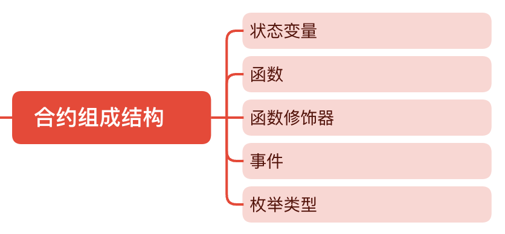

# 合约组成结构

你可能会有个疑问就是合约它都由什么基本结构组成的呢?我们在编写合约的时候又是如何把这些基本结构结合在一起的呢?这一节我们来探讨一下合约的七大组成结构,并且了解它们互相间的关系.

合约的七大组成结构有:

* 状态变量
* 函数
* 函数修饰器
* 事件
* Error
* 结构体
* 枚举 



## 一个典型的合约

为了方便介绍每个组成结构都是什么,长什么样的,我们先看一个例子.下面是一个Owner合约,它什么别的事情都不干,只是记录谁是这个合约Owner.

:::tip Owner合约
```solidity
// SPDX-License-Identifier: GPL-3.0

pragma solidity ^0.8.9;

contract Owner {

    struct Identity {
        address addr;
            string name;
        }

        enum State {
            HasOwner,
            NoOwner
        }

    event OwnerSet(address indexed oldOwnerAddr, address indexed newOwnerAddr);
    event OwnerRemoved(address indexed oldOwnerAddr);

    modifier isOwner() {
        require(msg.sender == owner.addr, "Caller is not owner");
        _;
    }

    Identity private owner;
    State private state;

    constructor(string memory name) {
        owner.addr = msg.sender; 
        owner.name = name;
        state = State.HasOwner;
        emit OwnerSet(address(0), owner.addr);
    }

    function changeOwner(address addr, string calldata name) public isOwner {
        owner.addr = msg.sender; 
        owner.name = name;
        emit OwnerSet(owner.addr, addr);
    }

    function removeOwner() public isOwner {
        emit OwnerRemoved(owner.addr);
        delete owner;
        state = State.NoOwner;
    }

    function getOwner() external view returns (address, string memory) {
        return (owner.addr, owner.name);
    }

    function getState() external view returns (State) {
        return state;
    }
}
```
:::
