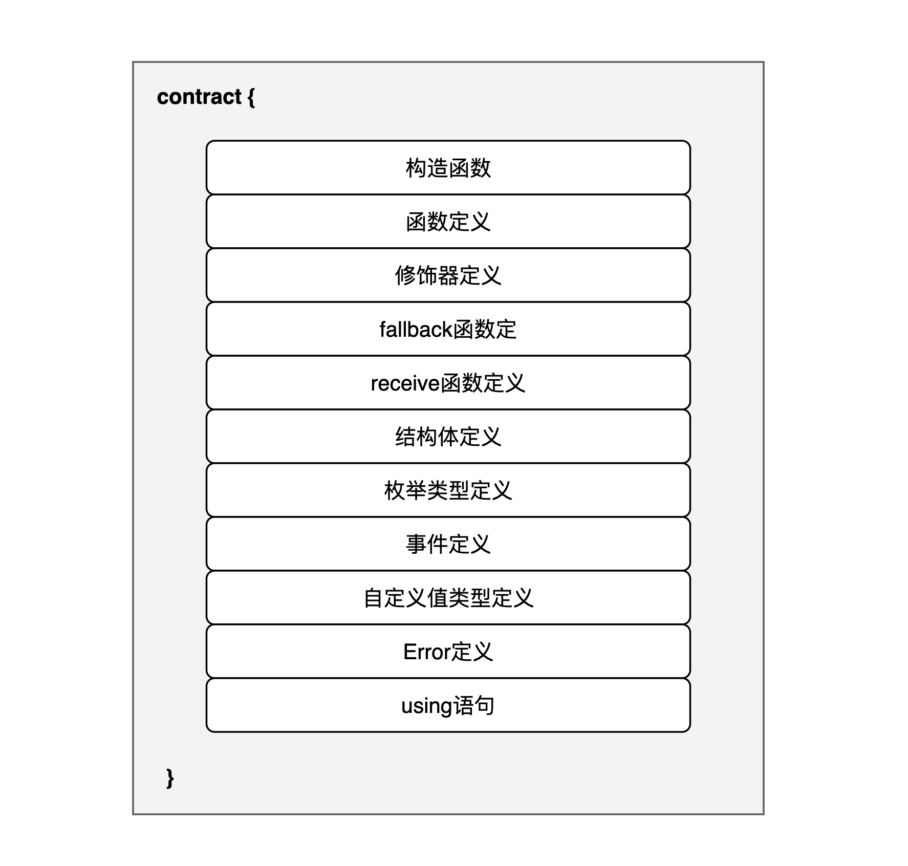

# Solidity 合约

在 Solidity 中, 合约类似于其他语言的类(_class_), 它有自己的成员属性和成员函数。例如去中心化交易所可以实现为一个合约，借贷平台的功能也可以实现为一个合约。可以使用 `contract` 关键字来定义一个新的合约:

```solidity
contract myContractName {
    // members
}
```

## 合约组成结构

下图展示了合约的组成结构:

  

其中, 每个组成成员的作用如下:

* **构造函数** : 用来初始化合约状态
* **函数** : 函数成员, 是一组逻辑代码块, 可以被其他函数调用
* **修饰器** : 修饰, 限制函数的行为
* **fallback函数** : 特殊函数, 调用合约时函数不存在便会执行fallback函数
* **receive函数** : 特殊函数, 用来接受ether转账
* **结构体** : 自定义类型, 用来组织多个不同类型的数据
* **枚举类型** : 有限个数值的集合, 用来提高可读性和类型安全
* **事件** : 类似于log, 用来记录函数执行事件
* **自定义值类型** : 用户自定义的值类型
* **Error** : 定义了函数可能抛出的Error, 可以被捕获处理, 提高合约安全性和稳定性
* **using语句** : using语句可以让你在当前合约使用其他合约或库中定义的函数, 而不需要显式调用

这些组成结构就类似于一个个积木，把它们以不同的形式排列组合起来就形成了合约。