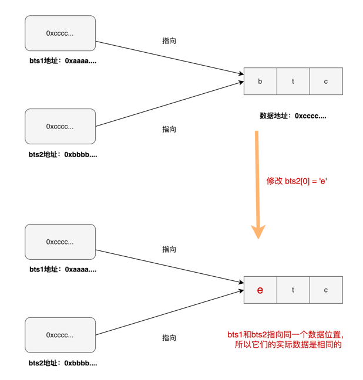

# 数据类型

合约本质上也是计算机程序，所以与其他程序一样可以处理多种多样的数据类型。而每种类型都可能有不同表示方式和操作方式。Solidity根据传参时是值传递还是引用传递可以分为两大类型，一种是「值类型」，另一种是「引用类型」。

## 值类型

「值类型」的变量保存的是实际的数据内容。值类型在进行赋值或者传参时**永远**都是值传递，也就是把数据直接拷贝过去的。这样赋值后的值和原来的值是**完全独立互不影响**的。

示例：值传递

```solidity
uint8 a = 1;
uint8 b = a;
```


### **值类型列表**

下面展示了Solidity中的绝大多数「值类型」。包括在其他语言也常见的布尔类型，整型，枚举类型等。也有一些是Solidity独有的类型，比如静态浮点型，静态字节数组，自定义值类型等等。这些类型我们都有单独的章节进行讨论，可以参看这些章节了解详细内容。


## 引用类型

「引用类型」的变量保存的是**数据存储的地址**，而不是数据本身。这样一来，在赋值或是传参时所传递的是数据的地址（_pass by reference_）。

### 引用类型列表

Solidity一共只有三种引用类型分别为：

* **数组** 一堆类型相同的变量集合
* **结构体** 一堆不同类型的变量集合
* **映射类型** 一堆键值对的集合


这三种引用类型我们都有单独的章节进行讨论，可以参看这些章节了解详细内容。

### 引用传递（_pass by reference_）

:::info 传数据地址又被称为「引用传递」
我们一般将赋值或是传参时所传递的是数据地址称之为「引用传递」（_pass by reference_）
:::

下面的示例中我们定义了两个字节数组 `bts1` 和 `bts2` 。在第2行中 `bts2 = bts1` ，这时 `bts2` 和 `bts1` 指向了同一个数据地址。当修改它们中任何一个时，另一个的值也会跟着发生变化。

:::tip 引用类型赋值时传的是地址（引用传递）

```solidity
bytes memory bts1 = "btc";
bytes memory bts2 = bts1;

console.log("bts1: %s", string(bts1)); // bts1: btc
console.log("bts2: %s", string(bts2)); // bts2: btc

bts2[0] = 'e'; //这里只改了bts2[0]的值，但是你会发现bts1[0]的值也会跟着变动

console.log("bts1: %s", string(bts1)); // bts1: etc
console.log("bts2: %s", string(bts2)); // bts2: etc
```

:::

下面的图示更具体展示了出现这种效果的原因：


现在我们明白什么是引用类型，什么是引用传递。那么所有的引用类型都是使用引用传递吗？答案揭晓：**不是**！引用类型到底是「值传递」还是「引用传递」还得看一个修饰符：「数据位置」(_data location_)修饰符。我们在「数据位置」的单独章节会解释一共有哪几种数据位置，并且引用类型在何种情况是「值传递」何种情况是「引用传递」。

# 小结
1. 在Solidity中，数据类型可分为值类型和引用类型
2. 值类型的变量保存的是实际的数据内容，在赋值或传参时是值传递，即直接拷贝数据
3. 引用类型的变量保存的是数据存储地址，在赋值或传参时是引用传递，即拷贝地址（不完全是，还与 `datalocation` 有关）
4. Solidity中的值类型包括：布尔类型、整型、枚举类型、静态浮点型、静态字节数组、自定义值类型等
5. Solidity中的引用类型包括：数组、结构体、映射类型
6. 在函数内部改变引用类型变量的值会影响原变量的值，而值类型变量则不会。
