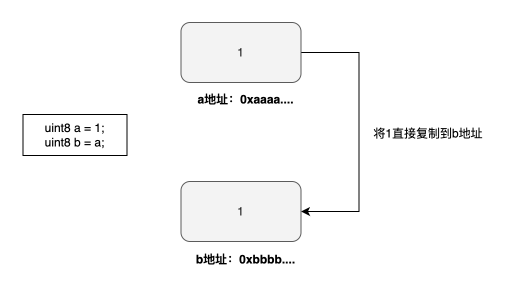
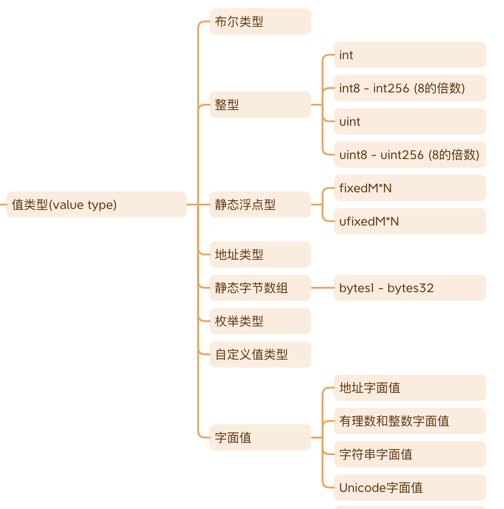
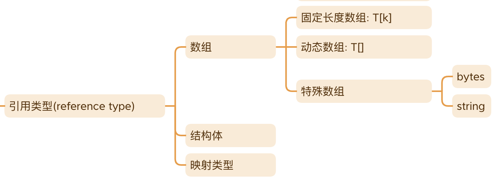

# 数据类型

合约本质上也是计算机程序，所以与其他程序一样可以处理多种多样的数据类型。而每种类型都可能有不同表示方式和操作方式。Solidity根据传参时是值传递还是引用传递可以分为两大类型，一种是「值类型」，另一种是「引用类型」。

# 值类型

「值类型」的变量保存的是实际的数据内容。值类型在进行赋值或者传参时**永远**都是值传递，也就是把数据直接拷贝过去的。这样赋值后的值和原来的值是**完全独立互不影响**的。

示例：值传递

```solidity
uint8 a = 1;
uint8 b = a;
```



## **值类型列表**

下面展示了Solidity中的绝大多数「值类型」。包括在其他语言也常见的布尔类型，整型，枚举类型等。也有一些是Solidity独有的类型，比如静态浮点型，静态字节数组，自定义值类型等等。这些类型我们都有单独的章节进行讨论，可以参看这些章节了解详细内容。



# 引用类型

「引用类型」的变量保存的是**数据存储的地址**，而不是数据本身。按理来说引用类型在赋值或者传参时应该传递的是引用地址（*数据存储地址*）才对。然而事实上，也不完全如此，其行为到底是拷贝还是传引用地址还取决一个参数就是「数据位置」（*data location*）。我们先看看都有哪些引用类型，再讨论数据位置。

## 引用类型列表

Solidity一共只有三种引用类型分别为：

- **数组**
- **结构体**
- **映射类型** （跟Python的dict，Go的map类似）



这三种引用类型我们都有单独的章节进行讨论，可以参看这些章节了解详细内容。

## 数据位置(*data location*)

定义引用类型的时候是**必须**要加上数据位置的，例如`uint[] storage`。Solidity可以指定的数据位置有三种：

- `storage` （数据会被存储在链上，是永久记录的，其生命周期与合约生命周期一致）
- `memory` （数据存储在内存，是易失的，其生命周期与函数调用生命周期一致，函数调用结束数据就消失了）
- `calldata` （与`memory`类似，数据会被存在一个专门存放函数参数的地方，与`memory`不同的是`calldata`数据是不可更改的。另外相比于`memory`，它消耗更少的Gas）

对于`storage`和`memory`这两个概念我们应该不难理解，可以想象成`storage`=磁盘，`memory`=RAM。但是对于`calldata`也许你会觉得陌生，到底其与`memory`有什么区别，为什么非要分出来这样的一种数据位置。由于这个是入门教程，我们暂时不引入过多的复杂性，使得读者觉得概念太多太复杂，学习路线太陡峭，所以我们会在「Solidity进阶教程」再深入讨论它们的区别。目前你只需要知道`calldata`相对于`memory`有这下面几个区别即可：

- 只能在引用类型的函数参数使用
- 数据不可更改（*immutable*)
- 易失的（n*on-persistent*)
- 消耗更少的Gas（g*as efficient*)

所以如果你的引用类型函数参数不需要修改，你应该尽可能使用`calldata`而不是`memory`。

# 参考资料

[https://eips.ethereum.org/EIPS/eip-4488](https://eips.ethereum.org/EIPS/eip-4488)

[https://eips.ethereum.org/EIPS/eip-2028](https://eips.ethereum.org/EIPS/eip-2028)

[https://stackoverflow.com/questions/33839154/in-ethereum-solidity-what-is-the-purpose-of-the-memory-keyword](https://stackoverflow.com/questions/33839154/in-ethereum-solidity-what-is-the-purpose-of-the-memory-keyword)

[https://betterprogramming.pub/solidity-tutorial-all-about-calldata-aebbe998a5fc?gi=e169bf2e1867](https://betterprogramming.pub/solidity-tutorial-all-about-calldata-aebbe998a5fc?gi=e169bf2e1867)

[https://ethereum.stackexchange.com/questions/74442/when-should-i-use-calldata-and-when-should-i-use-memory/74443#74443](https://ethereum.stackexchange.com/questions/74442/when-should-i-use-calldata-and-when-should-i-use-memory/74443#74443)