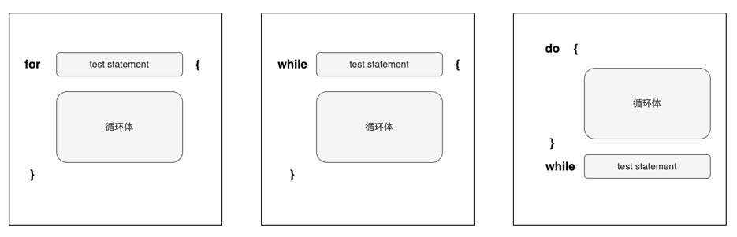

# do while循环

如果我们要计算`1+2+3`的和，这很简单：

```solidity
uint256 sum = 1+2+3;
```

但是如果我们要计算`1+2+3+…+100000`呢。直接在合约里面写出这个表达式是不可能的。为了避免重复劳动，我们就可以用到循环。Solidity提供了三种循环：

- **`for`循环**
- **`while`循环**
- **`do while`循环**

本节我们将会介绍`do while`循环。

## do while循环语法

Solidity的`do while`循环语法规则也与C语言基本相同，其语法如下：

```solidity
do {
    // 循环体
} while(test-statement);
```

我们可以看到`do while`循环和`while`循环非常类似，里面都有两个两个表达式，只不过这两个表达式的上下位置交换了：

* test-statement
* 循环体

`do while`循环区别于`while`循环的地方是，它的循环体**至少会执行一遍**。然后才会执行`test-statement`判断是否为`true`。如果是则把循环体再执行一遍。如果`test-statement`为`false`，那么退出循环并继续执行余下的代码。

:::tip `do while`循环, 从1加到n
```solidity
function sumToN(uint16 n) public pure returns(uint16) {
    uint16 sum = 0;
    uint16 i = 1; 

    do {
        sum += i;
        i++; // 修改循环变量的值
    } while(i <= n);
    
    return sum;
}
```
:::

## for, while, do while应该选哪个
我们在`while`循环章节已经讨论过`for`循环和`while`循环并没有太大的区别，更多的是不同的场景下其中一个比另外一个看起来更加简洁而已。 



但是`do while`与其他两个有明显的区别。这就是`do while`循环**至少会执行一次循环体**；而`for`和`while`循环可能一次都不执行。所以，当你确定循环体至少会被执行一次的时候，可以使用`do while`循环。这并不是说非用它不可，而是用了它，代码控制逻辑会看起来更加自然，代码也会更加简洁。

综上所述，`for`, `while`, `do while`三种循环本质上能做的事情都差不多，`for`和`while`比较类似，可以互换使用，取决于你觉得哪种可以让代码看起来更简洁。而`do while`一般是在循环体至少执行一次的时候使用。

