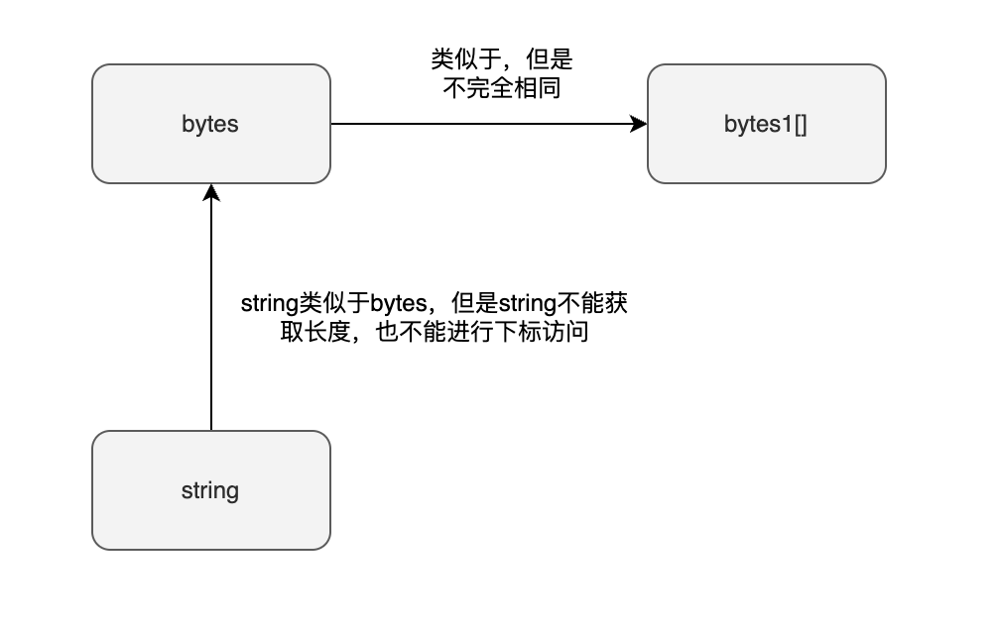
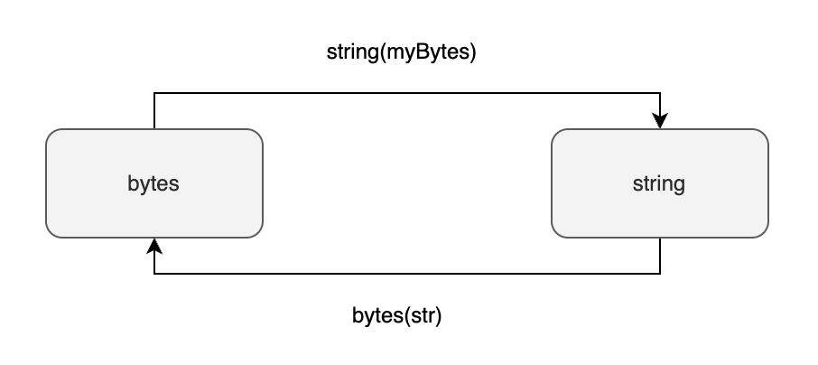

# Solidity 动态字节数组

前面介绍了[静态字节数组](static-byte-array)，它的长度是固定的，而且最长也就只有32字节。那么如果我们希望存放超过32个字符怎么办。又或者我们希望它的长度可以变化的，可以按需增加的。这个时候我们就可以使用动态字节数组(*dynamically-sized byte array*)。动态字节数组其实是数组类型(array)其中的一种类型，只不过是字节数组而已。我们单独抽出来介绍是想要跟静态字节数组做对比。

:::info 动态字节数组是引用类型
特别注意动态字节数组是引用类型（*reference type*），而静态字节数组是值类型（*value type*）
:::

## 动态字节数组与静态字节数组的区别

动态字节数组与静态字节数组有几点区别：

1. 静态字节数组长度是固定的，在编译期就已经确定；而动态字节数组的长度是不固定的
2. 静态字节数组的长度只能是1到32字节；而动态字节数组没有长度的限制
3. 动态字节数组是[引用类型](data-types)（*reference type*），也就是说其变量存储的其实是数组的地址；而静态字节数组是[值类型](data-types)（*value type*）

如果一个字节数组已经明确长度不会发生改变，而且长度小于等于32字节，那么建议使用静态字节数组。会更高效，更节省Gas。其他情况才推荐使用动态字节数组。

## 动态字节数组的种类

Solidity有两种动态字节数组：

- **bytes**
- **string**

其中 `bytes` 类似于 `bytes1[]` 不过 `bytes` 在 `memory` 和 `calldata` 位置会更加紧凑。Solidity 的[存储结构](https://docs.soliditylang.org/zh/v0.8.16/internals/layout_in_memory.html)里面规定了 `memory` 和 `calldata` 中的数组（比如`bytes1[]`）的每个元素都要占据32字节的倍数。不足32字节的，会自动 padding 到32字节。但是对于 `bytes` 和 `string` 没有这样的要求。所以 `bytes` 和 `string` 会比 `bytes1[]` 更加紧凑。

 `string` 的内部结构[基本等同](https://docs.soliditylang.org/en/develop/internals/layout_in_storage.html#bytes-and-string)于 `bytes` 的类型，**但是它不能进行下标访问，也不能获取长度**。换种说法就是 `string` 和 `bytes` 内部存储结构相同，但是对外访问接口不同。



## bytes与string的互相转换

bytes和string类型之间可以相互转换。需要用到：

- `bytes(str)`：       显式地将string转换成bytes
- `string(myBytes)`：  显式地将bytes转换成string



:::tip `bytes` 转 `string` 

```solidity
bytes memory bstr = new bytes(10);
string memory message = string(bstr); // 使用string()函数转换
```

<tryit fileName={ 'BytesToString.sol' } />

:::

:::tip `string` 转 `bytes` 

```solidity
string memory message = "hello world";
bytes memory bstr = bytes(message); //使用bytes()函数转换
```

<tryit fileName={ 'StringToBytes.sol' } />

:::

## string 不能进行下标访问，也不能获取长度

虽然 `string` 也是数组但是目前还不支持它的下标访问和长度的获取。

:::tip `string` 不能进行下标访问，也不能获取长度

```solidity
string str = "hello world";
uint len = str.length; // 不合法，不能获取长度
bytes1 b = str[0]; // 不合法，不能进行下标访问
```

<tryit fileName={ 'StringCannotAccessElement.sol' } />

:::

你可以将 `string` 转换成 `bytes` 后再进行下标访问和获取长度

:::tip 将 `string` 转换成 `bytes` 后再进行下标访问和获取长度

```solidity
string str = "hello world";
uint len = bytes(str).length; // 合法
bytes1 b = bytes(str)[0]; // 合法
```

<tryit fileName={ 'StringToBytesAccess.sol' } />

:::