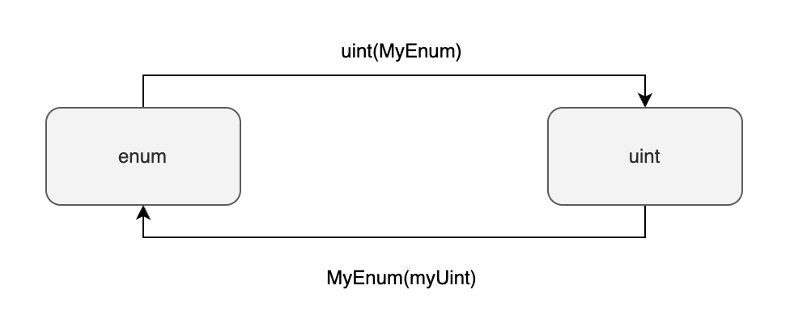

# 枚举类型

枚举是组织收集有关联变量的一种方式。我们将变量可能的取值一一列举出来，收集在一起，然后取个名字，这便定义了一个枚举类型。例如当你在开发一个链游的时候，需要根据键盘输入上下左右来控制游戏角色的动作。这时候你就可以定义一个ActionChoices类型，它有上下左右四个取值。

Solidity的枚举类型跟C语言的类似，都是一种特殊的整型。它们内部都表示为从`0`开始的正整数。

# 定义枚举类型

枚举类型的定义如下所示：

:::tip 定义枚举值类型 
```solidity
enum ActionChoices { 
    GoLeft,     // 0
    GoRight,    // 1
    GoUp,       // 2
    GoDown      // 3
}
```
:::

# 为什么使用枚举类型

使用枚举类型可以提高代码的类型安全性和可读性。因为它的变量可能取值只有四个，一旦你赋予了其他值，合约在编译期就会报错。例如，如果你用`uint8`类型来代表上下左右的动作，那么有可能你误传了999进去，合约可能会出现无法预料的后果。编译期是无法发现这样的Bug的。

提高代码可读性是显然易见的，`ActionChoices`肯定比`uint8`更容易理解其变量所保存内容的含义。

# 获取枚举值

你可以通过`.`操作符来获取枚举类型的某个枚举值。例如：

:::tip 使用枚举值
```solidity
ActionChoices choice = ActionChoices.GoLeft;
```
:::

# 枚举类型的最大最小值

枚举类型是一种特殊的整型，所以你可以获取枚举类型的最大最小值：

- `type(NameOfEnum).max` 枚举类型的最大值
- `type(NameOfEnum).min` 枚举类型的最小值

:::tip 获取枚举类型的最大最小值
```solidity
type(ActionChoices).max // ActionChoices.GoDown ，也就是3
type(ActionChoices).min // ActionChoices.GoLeft ， 也就是0
```
:::

# 枚举类型与整型的互相转换

枚举类型可以和任何整型进行互相转换：

- `uint(MyEnum)` 将枚举类型转换成`uint`
- `MyEnum(myUint)` 将`uint`转换成枚举类型



:::tip 枚举类型与整型的互相转换
```solidity
function enumToUint(ActionChoices c) public pure returns(uint) {
    return uint(c);
}

function uintToEnum(uint i) public pure returns(ActionChoices) {
    return ActionChoices(i);
}
```
:::

# 枚举类型作为函数参数或返回值

如果枚举类型仅在当前合约定义，那么外部合约在调用当前合约的时候它获取得到的枚举类型返回值应该是怎么样的？答案是枚举类型会被编译器自动转换成`uint8`类型。所以外部合约看到的枚举类型是`uint8`类型。这是因为ABI中没有枚举类型，只有整型，所以[编译器会自动执行这样的转换](https://docs.soliditylang.org/en/v0.8.17/abi-spec.html#mapping-solidity-to-abi-types)。

如下面的示例所示，`getChoice` 函数的返回值是ActionChoices类型。编译器会自动把返回值更改为`uint8`类型。所以外部合约看到的返回值类型是`uint8`类型。

:::tip 枚举类型作为函数参数或返回值时自动被转换成uint8
```solidity
// SPDX-License-Identifier: GPL-3.0
pragma solidity ^0.8.9;

contract Enum {
    enum ActionChoices { 
        GoLeft,     // 0
        GoRight,    // 1
        GoUp,       // 2
        GoDown      // 3
    }

    ActionChoices choice;

    // 因为ABI中没有枚举类型，所以这里的"getChoice() returns(ActionChoices)"函数签名
    // 会被自动转换成"getChoice() returns(uint8)"
    function getChoice() public view returns (ActionChoices) {
        return choice;
    }
}
```
:::

# 参考资料

[https://docs.soliditylang.org/en/v0.8.17/types.html#enums](https://docs.soliditylang.org/en/v0.8.17/types.html#enums)

[https://docs.soliditylang.org/en/v0.8.17/abi-spec.html#mapping-solidity-to-abi-types](https://docs.soliditylang.org/en/v0.8.17/abi-spec.html#mapping-solidity-to-abi-types)