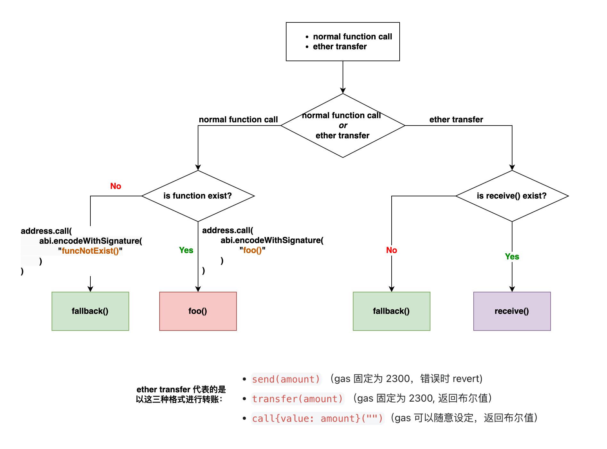
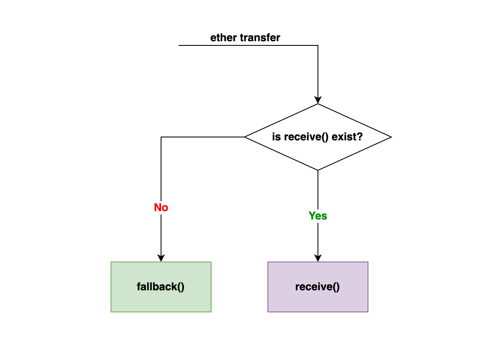
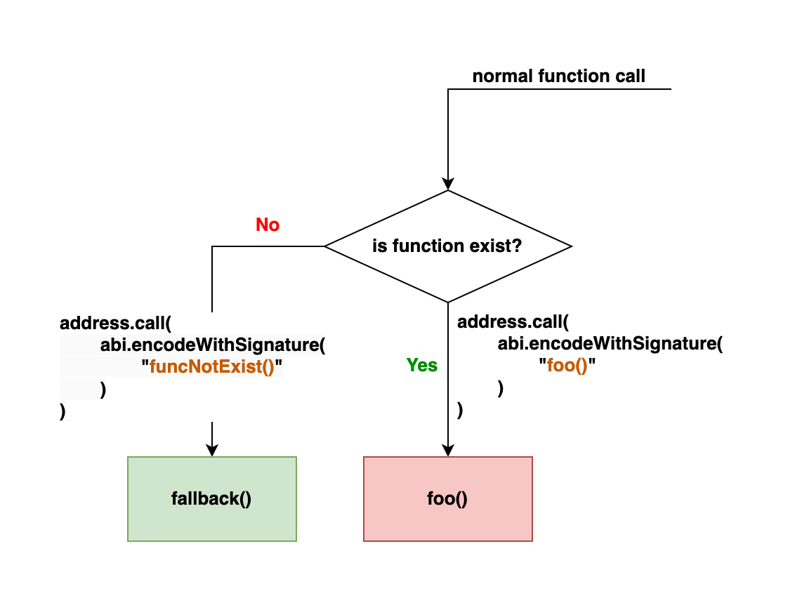

# Solidity fallback 函数

`fallback` 函数是 Solidity 中的一种特殊函数。当调用的函数匹配不到（不存在，没有定义）时自动使用 `fallback` 函数来兜底。顾名思义，`fallback` 在中文里有回退，兜底的意思。类比于当你没有带现金时，可以使用银行卡来付款一样。注意匹配不到，不存在，没有定义指的是同一个意思。

`fallback` 函数可以兜底两类函数不存在的情况：

- [receive](function-receive) 函数不存在（因为没有定义）
- 普通函数不存在（因为没有定义）

简单来讲就是：

- 需要用到 `receive` 函数时它没有被定义，那么就用 `fallback` 函数兜底
- 调用的函数在合约里不存在，没有被定义时，使用 `fallback` 函数兜底

下面这个图就表达了我们所谓「兜底」的含义。其中左半部分描述的是普通函数兜底，右半部分描述的是 `receive` 函数兜底：

  

## 兜底 receive 函数不存在的情况

我们在 [receive 函数](function-receive) 一节已经解析过，它只能在合约接受纯转账（*msg.data = empty*）时被触发：

- `send(amount)` （gas 固定为 2300，错误时 revert)
- `transfer(amount)` （gas 固定为 2300, 返回布尔值） 
- `call{value: amount}("")`（gas 可以随意设定，返回布尔值）

如果按照上面三个函数的格式调用来进行转账，那么 transacton 的 `msg.data` 是空的。所以理论上应该要触发 `receive` 函数。这个时候，如果刚好合约没有定义 `receive` 函数，那么 `fallback` 函数就自动会被用来兜底。如果 `fallback` 函数也没有定义，那么交易会失败 revert。

  

## 兜底普通函数不存在情况

这种情况比较好理解，就是字面上的意思。如果你调用了一个合约里面没有定义的函数，比如说 `funcNotExist()` 那么 `fallback` 函数就会自动被调用。

  

## 示例：receive 和 fallback 函数被调用场景

下面的示例展示了 `receive` 和 `fallback` 函数被调用的场景。极力推荐你自己进行尝试一下。可以留意一下注释内容进行操作。

:::tip `receive` 和 `fallback` 函数被调用场景

```solidity

// SPDX-License-Identifier: GPL-3.0

pragma solidity ^0.8.17;

contract Callee {
    event FunctionCalled(string);

    function foo() external payable {
        emit FunctionCalled("this is foo");
    }

    // 你可以注释掉 receive 函数来模拟它没有被定义的情况
    receive() external payable {
        emit FunctionCalled("this is receive");
    }

    // 你可以注释掉 fallback 函数来模拟它没有被定义的情况
    fallback() external payable {
        emit FunctionCalled("this is fallback");
    }
}

contract Caller {
    address payable callee;

    // 注意： 记得在部署的时候给 Caller 合约转账一些 Wei，比如 100
    // 因为在调用下面的函数时需要用到一些 Wei
    constructor() payable{
        callee = payable(address(new Callee()));
    }

    // 触发 receive 函数
    function transferReceive() external {
        callee.transfer(1);
    }

    // 触发 receive 函数
    function sendReceive() external {
        bool success = callee.send(1);
        require(success, "Failed to send Ether");
    }

    // 触发 receive 函数
    function callReceive() external {
        (bool success, bytes memory data) = callee.call{value: 1}("");
        require(success, "Failed to send Ether");
    }

    // 触发 foo 函数
    function callFoo() external {
        (bool success, bytes memory data) = callee.call{value: 1}(
            abi.encodeWithSignature("foo()")
        );
        require(success, "Failed to send Ether");
    }

    // 触发 fallback 函数，因为 funcNotExist() 在 Callee 没有定义
    function callFallback() external {
        (bool success, bytes memory data) = callee.call{value: 1}(
            abi.encodeWithSignature("funcNotExist()")
        );
        require(success, "Failed to send Ether");
    }
}

```

<tryit fileName={ 'CallingReceiveAndFallbackFunction.sol' } />

:::