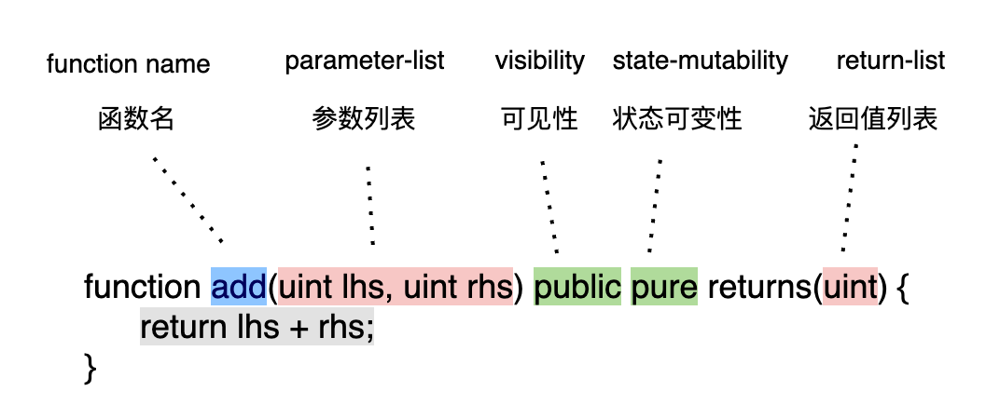
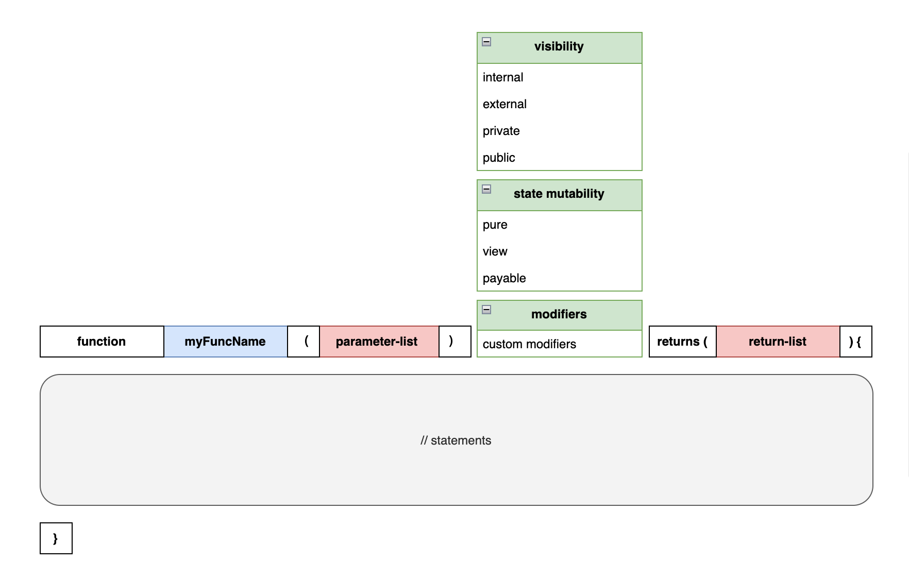

# 函数

函数是一组逻辑代码块，是构建合约的基本组成单位。 例如一个借贷合约可能包括几个操作：提供款项（supply），借款（borrow），还款（repay）等都可以实现为函数。

## 函数声明

我们先来看一个简单函数声明的例子：

:::tip 两数之和

实现了一个 `add` 函数，对两个数相加求和

```solidity

function add(uint lhs, uint rhs) public pure returns(uint) {
    return lhs + rhs;
}

```

:::

我们一个字段一个字段地看看这个函数声明中每个部分的含义。



  

* `function` 函数声明需要以 function 开头
* `add` 函数的名称
* `(uint lhs, uint rhs)` 函数的输入参数列表，这里有两个参数，分别是 lhs 和 rhs，都是无符号整型（uint）
* `public` 函数可见性，public 表示这个函数可以被外部调用
* `pure` 函数状态可变性，pure 表示这个函数不会更改合约状态，也不会调用其他函数
* `returns(uint)` 函数的返回值列表，是一个无符号整型
* `{ return lhs + rhs; }` 函数主体，包含了实际执行的操作, 在这里是返回 lhs 和 rhs 的和

这个函数的作用是接受两个无符号整型的参数 `lhs` 和 `rhs` ，并返回它们的和。这个函数是可以被外部调用的，并且是纯函数，不会更改合约状态。

## 函数声明语法

看完了上面的例子，我们现在再来看函数声明的语法就一目了然了。下图表示了函数声明应该包含的内容：



* `function` 函数声明需要以 function 开头
* `myFuncName` 函数的名称
* `( parameter-list )` 函数输入参数列表
* `visibility` 函数可见性，有四个选项：internal, external, private, public
* `state mutability ` 函数状态可变性（可选），有三个选项：pure, view, payable
* `modifiers` 函数修饰器（可选）， 可以限制, 修改函数的行为
* `returns (return-list)` 函数返回值列表（可选），指定返回值的类型，可以是多个返回值
* `{ // statements }` 函数主体， 包含实际执行的操作

图示中的 `state-mutability, modifiers, parameter-list, return-list` 都是可选的。所以函数声明可以是下面这样：

:::tip 函数声明示例

```solidity
// 仅指定 visibility
function f1() public {}

// 指定 visibility 和 state-mutability
function f2() public pure {}

// 指定 visibility 和 state-mutability
function f3() public view {}

// 指定 visibility 和 state-mutability，函数有入参
function f4(uint a) public pure {}

// 指定 visibility 和 state-mutability，函数有入参和返回值
function f5(uint a) public pure returns(uint) {}

// 指定 visibility 和 state-mutability，函数有多个入参和多个返回值
function f6(uint a, uint b, uint c) public pure returns(uint, uint, uint) {}

// 指定 visibility 和 modifier
function f7(uint a) external onlyOwner {} // onlyOwner 修饰器需要事先定义
```

:::

## 参数列表

你可以为函数提供零或多个参数。多个参数可以使用逗号进行分割。如下所示：

```solidity
// 提供0个参数
foo() public ;

// 提供1个参数
foo(1) public;

// 提供多个参数
foo(1, 2, 3) public;
```

## 返回值列表

你可以为函数提供零或多个返回值。多个返回值可以使用逗号进行分割。如下所示：

```solidity
// 提供0个返回值
foo() public ;

// 提供1个返回值
foo(1) public returns(uint);

// 提供多个返回值
foo(1, 2, 3) public returns(uint, uint, uint);
```

## 函数可见性

可见性（ *visibility* ）指的是其他合约对当前合约函数的可访问性（ *accessibility* ）。Solidity 函数有四种可见性可以选择： `public` , `private` , `internal` , `external`。

关于可见性的详细介绍和使用方法，可以参考[「可见性」](visibility)一节。

## 函数状态可变性

函数状态可变性是指函数内部是否能够修改合约的状态。默认情况下，函数是可以修改合约状态的。某些情况下你可能不希望合约状态被修改，为了提高合约安全性和可读性，你可以加上状态可变性修饰符。Solidity 有三种函数状态可变性可以选择：`view` , `pure` , `payable`。

关于可见性的详细介绍和使用方法，可以参考[「状态可变性」](state-mutability)一节。

## 函数修饰器

修饰器可以用来改变函数的行为，它们可以在函数执行前进行预处理和验证操作。例如可以验证函数入参是否符合预期，或者验证调用者是否具有特定的权限。使用修饰器能提高代码复用和可读性。

关于可见性的详细介绍和使用方法，可以参考[「修饰器」](modifier)一节。

