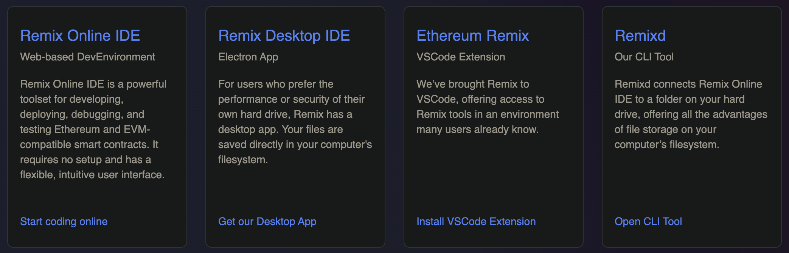
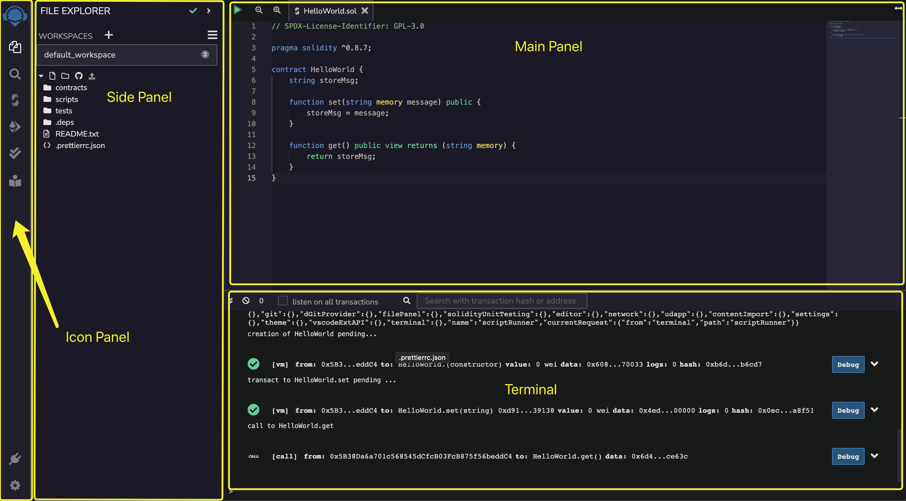
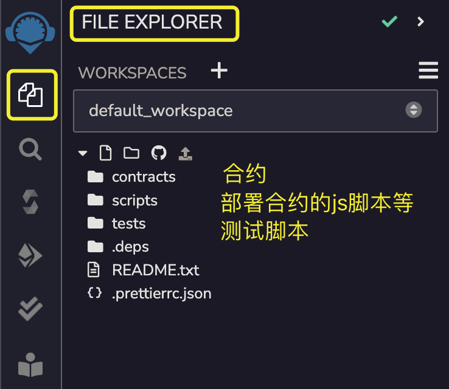
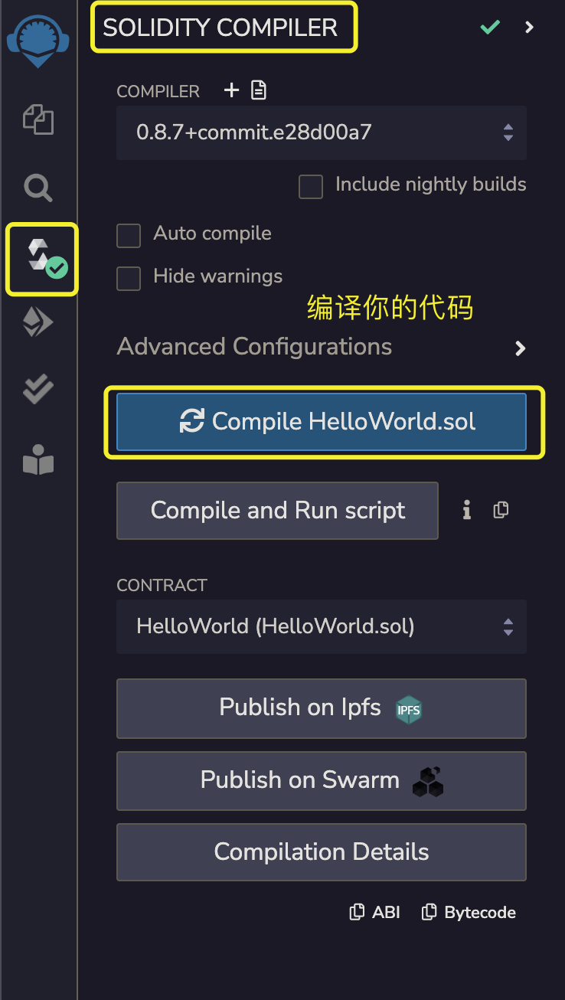
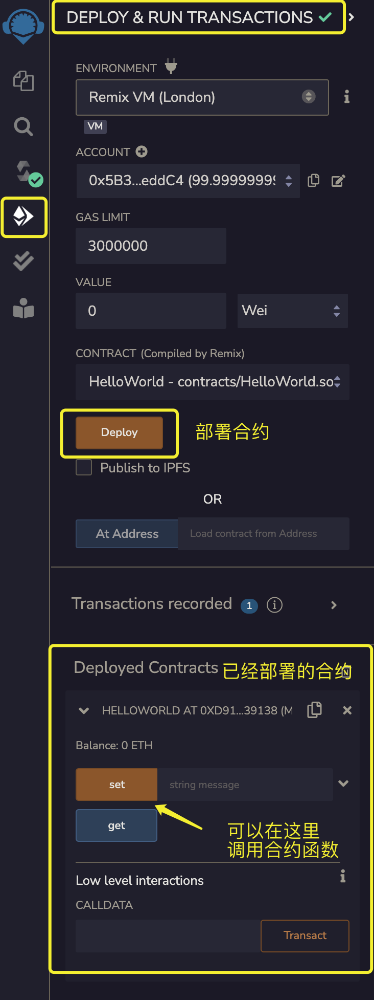

# Solidity 安装使用Remix IDE

在本章节以及之后的所有教程内容，我们都会使用Remix IDE作为我们的编译开发平台。Remix 是一个开源的Solidity 智能合约开发环境，提供基本的编译、部署至本地或测试网络、执行合约等功能。目前Remix提供四种IDE开发工具让你可以在自己电脑或者浏览器进行合约开发，它们是：

1. **Remix Online IDE**: 你可以在浏览器开发合约，无需安装任何东西（我们会在之后的例子中都使用它，并且我们也推荐你在学习的过程中使用它）
2. **Remix Desktop IDE**: 你可以在自己本地电脑开发合约
3. **Remix VSCode插件**: 你可以在VSCode使用Remix插件进行开发
4. **Remixd**: 是一个命令行工具，让你可以通过Remix Online IDE管理开发本地电脑储存的合约文件

可以从[这里](https://remix-project.org/)跳转到Remix官网下载或者使用上述的IDE工具。

## Remix界面

Remix IDE的界面如下图所示：

Remix一共划分了4个面板，分别为:

1. **Icon Panel**: 这个面板可以查看文件目录，编译，部署等等，它是用来控制Side Panel的，当你点击不同的Icon的时候，Side Panel也会跟着切换
2. **Side Panel**: 显示文件目录，编译，部署，以及查找文件等的具体信息
3. **Main Panel**: 主要显示和编辑代码
4. **Terminal Panel**: 这里显示合约部署和执行transaction的细节信息，也可以在这里执行Javascript脚本，例如web3js, ethers.js等

### Icon Panel & Side Panel交互

接下来介绍一下 Icon Pane l和 Side Panel 的主要交互操作。

第一个要介绍的是**File Explorer**。在这个面板下可以看到：合约，部署脚本以及测试脚本等代码的目录列表。点击这些代码文件，就会在Main Panel中打开，你便可以开始进行编辑。可以看到代码目录列表里面有三个文件夹，我们通常会把合约放在 `contracts/` ，然后把部署合约的Javascript脚本放在 `scripts/` ，测试脚本通常会放在 `tests/` 下面。

第二个要介绍的是**Solidity Compiler**。这个面板下你可以选择你的编译器版本，并且对你选定的代码文件进行编译。编译完成后你会得到相应的 ABI 和 Bytecode 文件。其中Bytecode文件是用来部署到以太坊虚拟机(EVM)的二进制文件。ABI [[more1]](https://moralis.io/what-is-a-smart-contract-abi-full-guide/)[[more2]](https://zhuanlan.zhihu.com/p/386106883)是应用程序二进制接口，有了 ABI，两个二进制程序才知道如何互相调用。ABI 在合约互相调用或者使用Javascript调用合约的时候会用到。我们在以后的章节会介绍更多关于 ABI 的内容以及它与API的区别。目前，你只需要知道 ABI 让合约间的交互成为可能即可。

第三个要介绍的是**Deploy & Run Transactions**。在这个面板你可以部署你的合约到链上，并且可以和你已经部署的合约进行交互。这个面板还允许选择部署合约的环境，包括各种测试环境或者公链。同时你也可以切换部署合约时所使用的账户等等。你可以在这个面板指定函数的入参，执行函数，并且得到函数返回值。之后的合约函数交互你会经常需要用到它。总而言之，所有与合约部署和交互有关的操作都可以在这个面板下进行。

其他几个面板我们暂时不需要用到，可以暂时不理会，包括单元测试，搜索，和插件管理等面板你可以自己尝试使用，我们在这里再不展开介绍。

## 小结

在本节，我们学习了Remix IDE的基本界面和简单的交互操作。学会了如何放置合约，Javascript脚本，以及测试脚本到正确的目录。学习了如何编译，部署，与合约交互。接下来我们会正式开始学习Solidity的内容。
