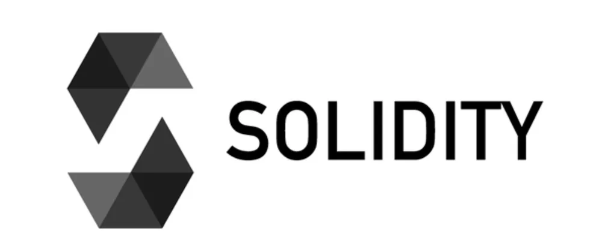
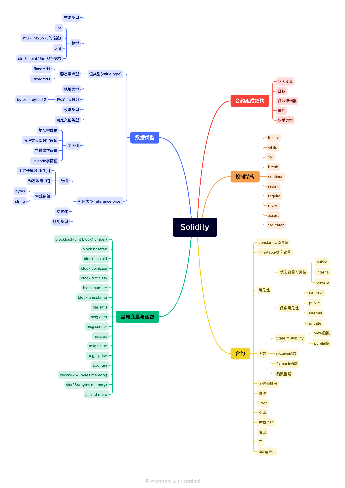

# Solidity简介

Solidity是一门专门用来编写智能合约的静态类型语言。它被广泛应用在各种公共或者私有区块链平台(以太坊，Polygon, BSC等)。它是我们入门智能合约的首选语言，目前围绕着Solidity已经产生了许许多多，不胜枚举的去中心化应用(Dapp)。

在这篇教程里面我们将会带你领略最基本的智能合约开发，你将会学到以下的内容：

1. 智能合约的基本概念
2. 合约的组成部分
3. 基本数据类型
4. 类型转换
4. 控制结构
5. 函数
6. 函数修饰器
7. 可见性
8. 事件
9. Error 
10. 接口
11. 全局函数

Example First永远是我们的第一原则，我们相信一个简单易懂的示例胜过1000行晦涩的文字说明。我们之后的教程开展将会提供足够多的示例。我们也鼓励你亲自将示例里面的代码自己运行一遍，因为程序运行的细微变化往往是无法仅仅通过观察代码就能全部了解的。

对于本教程如果有任何反馈也欢迎与我联系。