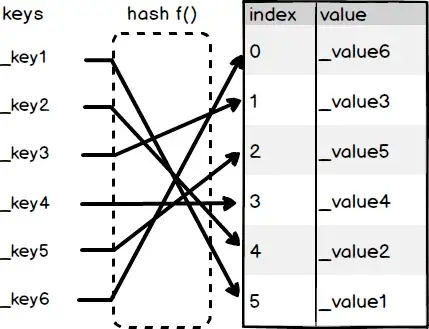

# 映射类型

Solidity中的映射类型是一种键值对（_key-value pair_）存储方式。让你可以通过「键」（_key_）快速找到「值」（_value_）。假设我们准备给一些用户发放空投，我们开放一个接口让用户来看看自己有没有空投份额，应该怎么实现呢？一种可能的方式是我们定义一个数组，数组里的每个元素都是一个结构体。结构体有两个属性，一个是用户的地址，一个是用户可以拿到的空投 Token 数。如下面所示：

:::tip 数组存放空投用户列表
```solidity
struct AirDrop {
    address to;
    uint amount;
}

AirDrop[] airDrop;
```

然后如果用户来查询自己有没有空投，我们就直接遍历整个数组，看看有没有地址和他的地址是相等的。如下面所示：

```solidity
AirDrop[] airDrop;
function getAirDropAmount(address addr) public view returns(uint) {
    for(uint i = 0; i < airDrop.length; i++) {
        if(airDrop[i].to == addr) {
            return airDrop[i].amount;
        }
    }
    return 0;
}
```
:::

这种方法虽然可行，但是它的缺点是低效。每次有一个用户要查询都必须要遍历整个数组。这个时候我们可以使用映射类型来存储空投列表，提高查询效率。使用映射类型，你可以在常数时间内就找到用户的空投数额，而不是像上面一样遍历整个空投列表。

## 什么是映射类型

映射类型存储的是 key 和 value 的对应关系。类似于函数 `f(x) = y`， 给定 `x` 值，你可以得到 `y` 一样。在映射类型里，给定了 key， 你就可以找到相应的 value。

Solidity 的映射类型底层实现是个 [HashTable](https://en.wikipedia.org/wiki/Hash_table)。如下图所示，最右边是一个数组，存储了 多个 value 。Index 表示的是数组的下标，也就是 value 的位置。 然后，key 通过 [Hash](http://www.unixwiz.net/techtips/iguide-crypto-hashes.html) 函数 `f(key)` 运算得到了相应的 Index 位置。接下来我们可以用这个 Index 把 value 取出。



可以看到在映射类型里，我们可以通过 Hash 运算很快地找到 value 所在的位置，而不需要遍历整个数组。大大提高了存取效率。

## 映射类型变量的声明

接下来我们看看如何声明一个映射类型的变量。其声明格式如下：

```solidity
mapping(KeyType => ValueType) varName;
```

其中 `KeyType` 是键的类型，它可以是任何「内置值类型」（_built-in value type_）。例如 `uint, string, bytes` 等等。但是不能是数组，结构体，映射类型这些引用类型。

然后 `ValueType` 是值的类型。它可以是任意类型，包括数组，结构体等。 此外，`varName` 是你取的任意变量名。

例如我想要声明一个空投数额记录，我们可以这样声明：

:::tip 映射类型记录空投数额
```solidity
mapping(address => uint) airDrop;
```
:::

## 如何使用key存取value

如果你想通过 `key` 来存取对应 `value`， 可以使用 `[]` 操作符。

:::tip 使用 [] 操作符
新增一个键值对
```solidity
airDrop[0xaaaaa...] = 100;
```
通过 key 获取 value
```solidity
unit amount = airDrop[0xbbbb...];
```
:::

## 映射类型只能声明在 storage

Solidity 仅允许映射类型声明在 `storage`。声明在其他数据位置都会报错。

:::tip 映射类型不能声明为除了 `storage` 之外的位置
```solidity
mapping(address => uint) memory myMap; // 编译错误
```
:::

## 映射类型使用在入参和返回值时，函数可见性必须是 private 或 internal

* 函数的可见性为 `public` 或 `external`时， 那么在入参和返回值里面**不能**使用映射类型。
* 函数的可见性为 `private` 或 `internal`时，那么在入参和返回值里面**可以**使用映射类型。

如果你还不知道什么是函数的可见性（_visibility_），可以暂时先略过这部分。

下面的例子展示了这个规则：

:::tip 
```solidity
function invalidDeclaration(mapping(address => uint) storage myMap) public {} // 编译错误
function invalidDeclaration(mapping(address => uint) storage myMap) external {} // 编译错误
function validDeclaration(mapping(address => uint) storage myMap) private {} // 合法
function validDeclaration(mapping(address => uint) storage myMap) internal {} // 合法
```
:::

## 映射类型可以与数组，结构体互相嵌套

我们在结构体那一节已经介绍过结构体和数组可以互相嵌套。其实这三种引用类型之间都可以互相嵌套。例如，下面的例子中，我们使用映射类型来建立了 `ISBN` 和 `Book` 之间的映射关系。当我们有 `ISBN` 时，就可以找到对应的 `Book`。


:::tip 结构体与映射类型互相嵌套
```solidity
struct Book {
    uint isbn;
    string title; // 书名
    uint price;   // 价格
}

mapping(uint => Book) lib; // 从 ISBN 到 Book 的映射关系
```
:::

## 映射类型的其他特性

Solidity 的映射类型还有一些其他特性：

1. 没有 `length` 属性
2. 无法进行遍历

所以如果你想要知道映射类型的 `length` 究竟是多少，或者想要遍历整个映射类型，这都需要自己实现。不过在合约使用到的大多数场景中，都不会有这种需求。