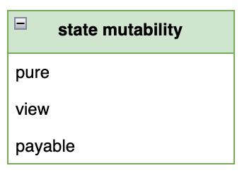

# Solidity 状态可变性

合约函数通常需要修改区块链的状态，例如转账，修改状态变量，触发事件等等。但是有一小部分函数只是起辅助作用的，你不希望它们去修改合约的状态。这个时候你可以使用状态可变性修饰符（*state mutability modifier*）来修饰你的函数。这样显式地表示你不希望这个函数修改合约状态。一旦函数内部试图修改合约状态，编译器会抛出编译错误。利用好状态可变性可以提高合约安全性，可读性，还可以方便 Debug。

Solidity 提供了三个状态可变性修饰符：

  


- `view` 函数只能查询合约状态，不能更改合约状态。简单来讲就是只读不写的
- `pure` 既不能查询，也不能修改函数状态。只能使用函数参数进行简单计算并返回结果
- `payable` 允许函数接受 Ether 转账。函数默认情况下是不能接受转账的，如果你需要接受转账，那么必须指定其为 payable

## 怎样才算查询合约状态

上面我们所谈到的查询合约状态是一个笼统定义。我们需要明确界定到底哪些行为会被认为是查询了合约状态。Solidity 中有5种行为被认为是查询了合约状态：

1. 读取状态变量
2. 访问  `address(this).balance` 或者 `<address>.balance`
3. 访问 `block` , `tx` , `msg` 的成员
4. 调用未标记为 `pure` 的任何函数
5. 使用包含某些操作码的内联汇编 

## 怎样才算修改合约状态

同样地，我们也需要明确界定到底哪些行为会被认为是修改了合约状态。Solidity 中有8种行为被认为是修改了合约状态：

1. 修改状态变量
2. 触发事件
3. 创建其他合约
4. 使用 `selfdestruct` 来销毁合约
5. 通过函数调用发送以太币
6. 调用未标记为 `view` 或 `pure` 的任何函数
7. 使用低级别调用，如 `transfer`, `send`, `call`, `delegatecall` 等
8. 使用包含某些操作码的内联汇编

## view 函数

如果你的函数承诺不会修改合约状态，那么你应该为它加上 `view` 修饰符。如下所示：

:::tip `view` 函数

```solidity

uint count;
function GetCount() public view returns(uint) {
    return count;
}

```

<tryit fileName={ 'ViewFunction.sol' } />

:::

关于 `view` 函数的更详细介绍，可以参见[「view 函数」](function-view)一节。

## pure 函数

如果你的函数承诺不需要查询，也不需要修改合约状态，那么你应该为它加上 `pure` 修饰符。如下所示：

:::tip `pure` 函数

```solidity

function add(uint lhs, uint rhs) public pure returns(uint) {
    return lhs + rhs;
}

```

<tryit fileName={ 'PureFunction.sol' } />

:::

关于 `pure` 函数的更详细介绍，可以参见[「pure 函数」](function-pure)一节。

## payable 函数

函数默认是不能接受 Ether 转账的。如果你的函数需要接受转账，那么你应该为它加上 `payable` 修饰符。如下所示：

:::tip `payable` 函数

```solidity

function deposit() external payable {
    // deposit to current contract
}

```

<tryit fileName={ 'PayableFunction.sol' } />

:::