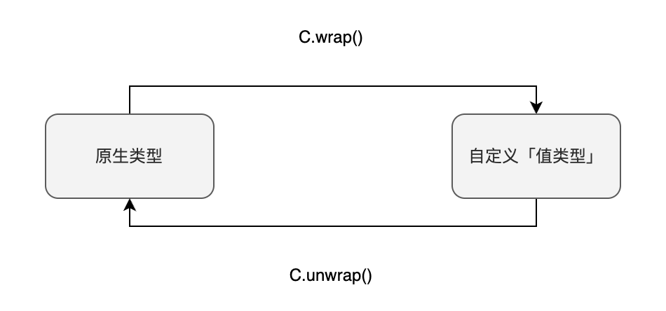

# 自定义值类型

自定义「值类型」（*User Defined Value Types*****），****是用户自定义的「值类型」。注意这里定义的是「值类型」，还有一种自定义的类型是结构体（*struct*），但是它是一种引用类型，之后我们会介绍。自定义值类型类似于别名（*alias*），但是不等同于别名。别名和原类型是一模一样的，只不过是名字不同而已。而自定义值类型缺少原类型的操作符（也就是`+ - * /`等操作符不能再使用）。它的主要存在价值是提高类型安全性和代码可读性。

:::note
自定义值类型这个词比较拗口，我们直接使用英文User-Defined Value Type代替，以进行接下来的介绍。
:::

# 定义User-Defined Value Type

我们可以通过`type C is V`来定义新的User-Defined Value Type。其中`C`是新定义的类型，而`V`则必须是Solidity的原生类型。例如，下面的例子中定义了两种新类型：

:::tip 定义User-Defined Value Type
```solidity
type Weight is uint128;
type Price  is uint128;
```
:::

# User-Defined Value Type有什么好处

## 提高类型安全性

使用User-Defined Value Type可以提高代码的类型安全性。例如下面的代码中，会产生编译错误`*TypeError: Operator + not compatible with types UserDefinedValueType.Weight and UserDefinedValueType.Price.*` 因为`Weight`和`Price`是不同的类型，不能进行算术运算。这提高了类型安全性，避免直接使用`uint128`类型时误用的情况发生。

:::tip 提高类型安全性
```solidity
Weight w = Weight.wrap(10);
Price  p = Price.wrap(5);
Weight wp = w+p; //编译错误
Price  pw = p+w; //编译错误
```
:::

## 提高代码可读性

提高代码可读性就显而易见了，例如前一个例子中你知道`w`是`Weight`类型，你就知道`w`的含义是重量。同理`p`的类型为`Price`，代表的是价格。

# 类型转换

User-Defined Value Type和原生类型之间是没有隐式类型转换的，那么我们应该如何进行类型转换？我们可以通过显式调用下面两个转换函数：

- `C.wrap`    用来将原生类型转换成User-Defined Value Type
- `C.unwrap` 用来将User-Defined Value Type转换成原生类型



:::tip User-Defined Value Type与原生类型之间的类型转换
```solidity
Weight w = Weight.wrap(100);
uint128 u = Weight.unwrap(w);
```
:::

# User-Defined Value Type不继承操作符

要注意到User-Defined Value Type是不继承原生类型的操作符的，包括`+ - * /` 等等。例如下面的例子中编译器是会报错`*TypeError: Operator + not compatible with types UserDefinedValueType.Weight and UserDefinedValueType.Weight.*`：

:::tip User-Defined Value Type使用原生类型操作符报错
```solidity
Weight w1 = Weight.wrap(10);
Weight w2 = Weight.wrap(20);
Weight sum = w1+w2; // 编译器报错
```
:::

如果你确实需要对`Weight`实现加法运算，那么你必须要定义一个新的函数，例如：

:::tip User-Defined Value Type需要自定义函数来代替操作符
```solidity
function add(Weight lhs, Weight rhs) public pure returns(Weight) {
  return Weight.wrap(Weight.unwrap(lhs) + Weight.unwrap(rhs));
}
```
:::

# 参考资料

[https://blog.soliditylang.org/2021/09/27/user-defined-value-types/](https://blog.soliditylang.org/2021/09/27/user-defined-value-types/)

[https://forum.soliditylang.org/t/user-defined-value-types/314/20](https://forum.soliditylang.org/t/user-defined-value-types/314/20)

[https://forum.soliditylang.org/t/user-defined-types-and-operators/456](https://forum.soliditylang.org/t/user-defined-types-and-operators/456)