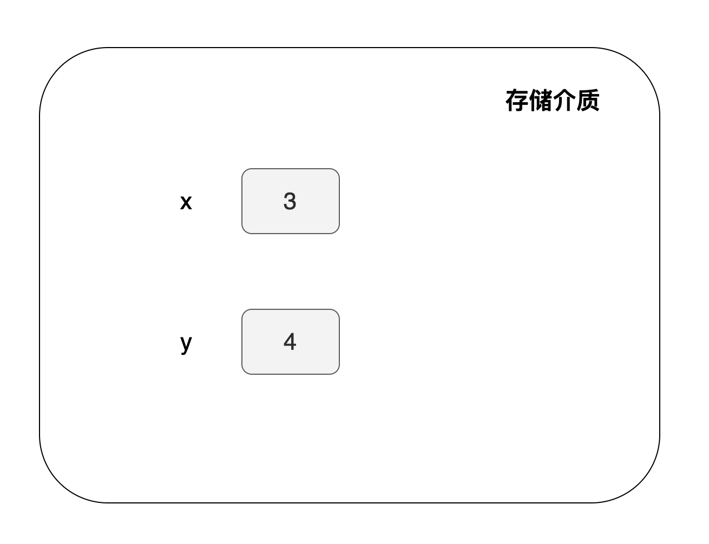

# 变量

合约里面常常需要记录一些状态数据，例如 Token 余额， NFT ID 等等。那么这些状态是放在哪里呢？答案是：这些数据被放在变量里，我们可以对变量进行运算操作。在 Solidity 中，变量就是用来存储数据的容器。

如果你学过初等代数，那么你应该知道 `x=3, y=4` 这个表达式表示的是把 `3` 赋值给 `x` ， 把 `4` 赋值给 `y` 。合约变量的表达式也类似。例如，下面的表达式中定义了两个变量，一个是 `x` ，它的值是 `3` ， 另一个是 `y` ， 它的值是 `4` 。

```solidity
uint x = 3;
uint y = 4;
```

我们说过变量是用来存储数据的容器，所以它们会在存储介质里面占据一定的空间。如下面所示：



  

## 数据类型

上面我们定义了两个变量，它们的类型都是 `uint` 。Solidity 是静态类型语言，需要为每个变量都指定类型。你可以为变量指定下面的类型:


  

我们会有单独的章节介绍这些类型，左侧边栏可以跳转到这些章节。

## 数据位置

我们上面有提到变量是记录在存储介质上面的。普通应用程序的数据可能存在内存里或者磁盘里。其中存在内存的数据是易失的，程序退出运行后，就不再存在了。存在磁盘的数据是永久的，下次程序运行数据会被重新读取。同理，合约也会有不同的数据位（*data location*）置。比如，有些变量是永久记录在链上的；有些变量是存在 EVM 内存里的，函数退出后就消失了。

Solidity 一共有三种数据位置，指定了变量数据位置。它们分别为：

* `storage` （数据会被存储在链上，是永久记录的）
* `memory` （数据存储在内存，是易失的）
* `calldata` （数据会被存在一个专门存放函数参数的地方）

其中，数据位置在 `storage` 的就是我们常常提到的「状态变量」。它的数据是永远记录在链上的。

我们会在 [「数据位置」](*data-location*) 一节展开讨论。
