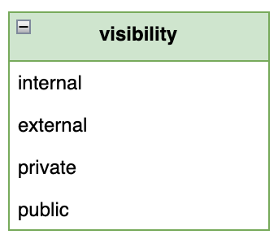
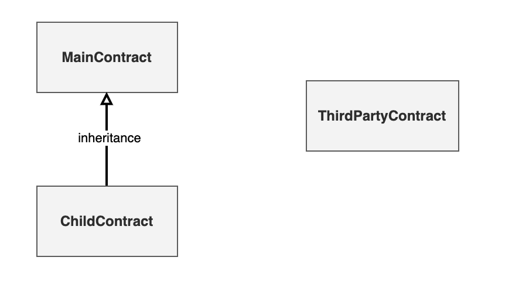
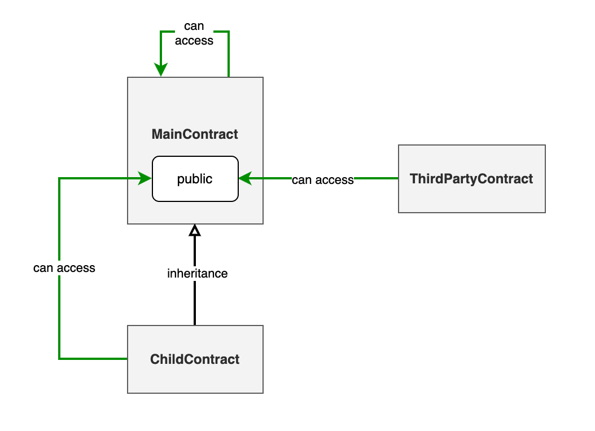
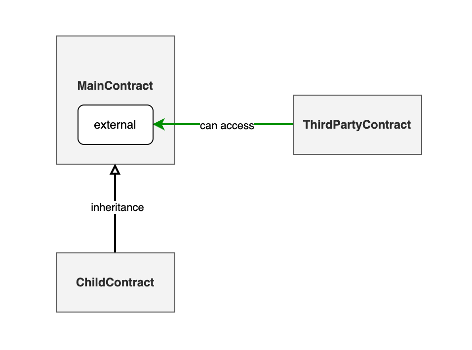
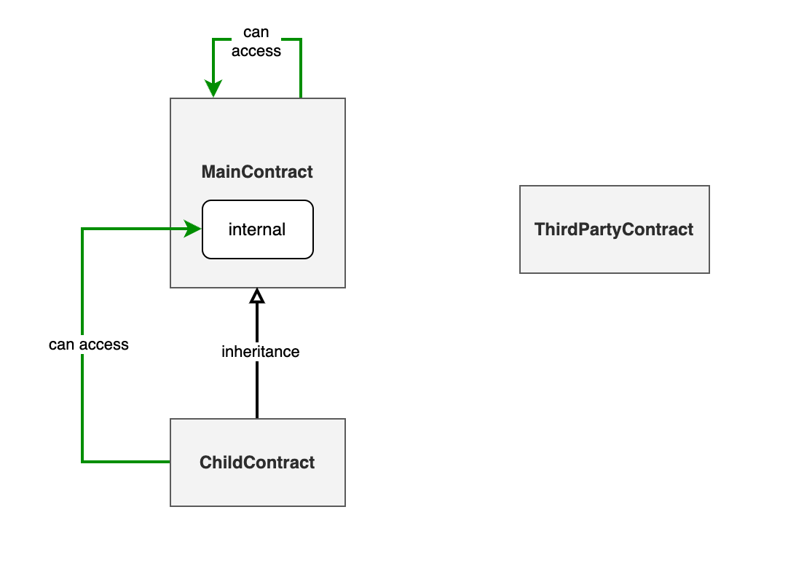
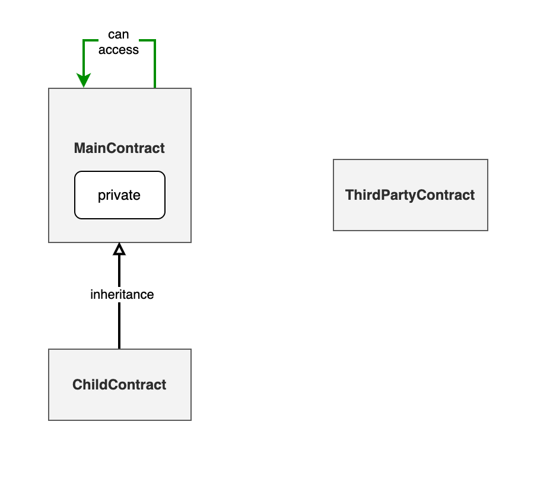

# 可见性

为了保证合约安全性, Solidity 对变量和函数的访问进行限制。可见性（ `visibility` ）指的是其他合约对当前合约中的变量或函数的可访问性（ `accessibility` ）。换一种说法就是：其他合约能不能访问当前合约的变量和函数是由可见性决定的。

Solidity支持四种可见性修饰符：

  

* `public` 修饰符表示该变量或函数可以在合约内部和外部访问
* `external` 修饰符表示该变量或函数只能在合约外部访问
* `private` 修饰符表示该变量或函数只能在合约内部访问
* `internal` 修饰符表示该变量或函数只能在合约内部和继承该合约的合约中访问

其中，变量可见性修饰符有三个： `public` , `private` , `public` 。而函数包含上面所有四个修饰符。

## 合约分类

我们在上面看到有合约内部，合约外部，继承合约等等名词。它们到底是什么含义呢？本小结我们将会分类进行说明。根据可见性的限制，我们可以把合约分为三类：

1. 主合约 （也就是合约内部）
2. 子合约 （也就是继承合约）
3. 第三方合约 （也就是合约外部）

  


简单来讲，子合约继承了主合约，而第三方合约跟主/子合约没有继承关系。把主合约和子合约想象成一个家庭的话，第三方合约就是个陌生人。

### 主合约

主合约就是一个普通合约，内部定义了很多变量和函数。这些变量和函数可能有不同的可见性。主合约可以访问自己的 `private` , `internal` , `public` 任何变量和函数。

```solidity
// 主合约可以访问自己的 private, internal, public 变量和函数
contract MainContract {
    uint varPrivate;
    uint varInternal;
    uint varPublic;

    function funcPrivate() private {}
    function funcInternal() internal {}
    function funcExternal() external {}
    function funcPublic() public {}
}

```

### 子合约

子合约继承了主合约。继承的语法是 `Child is Parent` 。子合约允许访问可见性为 `internal` ， `public` 的函数。

```solidity

contract ChildContract is MainContract {
    function funcChild() private {
        funcInternal(); // 子合约可以访问可见性为internal，public的函数
        funcPublic(); // 子合约可以访问可见性为internal，public的函数
    }
}

```

### 第三方合约

第三方合约是一个普通合约。可以通过主合约的地址来与主合约进行交互, 其交互语法如下所示。第三方合约可以访问可见性为 `external` ， `public` 的函数

```solidity

contract ThirdPartyContract {
      function funcThirdParty(address mainContractAddress) private {
            MainContract(mainContractAddress).funcExternal(); // 第三方合约可以访问可见性为external，public的函数
            MainContract(mainContractAddress).funcPublic(); // 第三方合约可以访问可见性为external，public的函数
      }
}

```

## 可见性对于合约访问的限制

我们已经提到，可见性就是合约变量和函数的可访问性。那么可见性对每种类型合约的访问限制是什么呢？本小结将会展开讨论。

### public

可见性为 `public` 的变量和函数可以被任何合约访问。也就是可以被 `MainContract` , `ChildContract` , `ThirdPartyContract` 访问。

  

### external

可见性为 `external` 的函数只能被第三方合约访问。也就是只能被 `ThirdPartyContract` 访问。注意变量是没有 `external` 修饰符的。

  

### internal

可见性为 `internal` 的变量和函数可以被主合约和子合约访问。也就是可以被 `MainContract` , `ChildContract` 访问。

  

### private

可见性为 `private` 的变量和函数只能被主合约访问。也就是只能被 `MainContract` 访问。

  

